# DocTrac (Doctor Tracker)

DocTrac is a secure admin portal for running a clinic's day-to-day roster: it lets an authenticated administrator manage doctors and the patients under each one, search and filter both lists, and read the whole operation at a glance from a dashboard of live analytics (total doctors, total patients, patients per doctor, and month-over-month growth). It is built as two independent applications, a Next.js client and a standalone Express API, talking over a REST interface, so each half can be developed, deployed, and scaled on its own.

## Table of Contents

- [Tech Stack](#tech-stack)
- [Setup Guide](#setup-guide)
- [System Architecture](#system-architecture)
- [Technical Decisions](#technical-decisions)
  - [1. A shared Zod schema package instead of duplicated validation](#1-a-shared-zod-schema-package-instead-of-duplicated-validation)
  - [2. Cookie-based JWT auth, and the cross-domain bug it caused in production](#2-cookie-based-jwt-auth-and-the-cross-domain-bug-it-caused-in-production)
  - [Other decisions worth knowing about](#other-decisions-worth-knowing-about)
- [Project Structure](#project-structure)
- [Visual Evidence](#visual-evidence)

## Tech Stack

| Layer | Choices |
| --- | --- |
| Client | Next.js 16 (App Router, TypeScript), Tailwind CSS v4, shadcn/ui (`radix-vega` style), TanStack Query, TanStack Table, React Hook Form + Zod, Recharts (via shadcn Charts) |
| Server | Node.js, Express 5, TypeScript, `tsx` runtime, Mongoose, Zod, JWT, bcryptjs |
| Database | MongoDB (indexed collections, aggregation pipelines for the dashboard) |
| Shared | `@doctrac/shared`, an npm workspace package of Zod schemas and DTOs used by both apps |
| Deployment | Render (two separate Web Services, one per app) |

## Setup Guide

### Prerequisites

- Node.js 20+ and npm 10+
- A MongoDB connection string, either a local `mongod` instance or a free [MongoDB Atlas](https://www.mongodb.com/atlas) cluster

### 1. Clone and install

```bash
git clone https://github.com/pratikdev/doctrac.git
cd doctrac
npm install
```

This is an npm-workspaces monorepo (`client`, `server`, `shared`), so a single `npm install` run from the repo root installs and links all three.

### 2. Configure environment variables

Each app has its own `.env.example`. Copy both and fill them in:

```bash
cp server/.env.example server/.env
cp client/.env.example client/.env
```

`server/.env`:

| Variable | Purpose |
| --- | --- |
| `NODE_ENV` | `development` locally, `production` when deployed |
| `PORT` | Port the Express server listens on (default `5000`) |
| `MONGODB_URI` | MongoDB connection string, local or Atlas |
| `JWT_SECRET` | Long random string used to sign auth cookies |
| `CLIENT_URL` | Origin of the Next.js client, used for CORS and cookie settings |
| `ADMIN_NAME`, `ADMIN_EMAIL`, `ADMIN_PASSWORD` | Used only by `npm run seed` to create the one admin account |

`client/.env`:

| Variable | Purpose |
| --- | --- |
| `NEXT_PUBLIC_API_URL` | Base URL of the Express API (`http://localhost:5000` locally) |

### 3. Seed the database

```bash
npm run seed --workspace=server
```

Creates (or updates) the single admin account from `ADMIN_NAME`/`ADMIN_EMAIL`/`ADMIN_PASSWORD`. Optionally, seed sample data to explore the app with something on screen:

```bash
npm run seed:data --workspace=server
```

Creates 12 doctors across a spread of specializations, each with a handful of randomly generated patients.

### 4. Run the app

From the repo root:

```bash
npm run dev
```

Runs both the client (`http://localhost:3000`) and the server (`http://localhost:5000`) concurrently. Log in with the admin credentials from step 2.

To run either half on its own: `npm run dev:client` or `npm run dev:server`.

## System Architecture

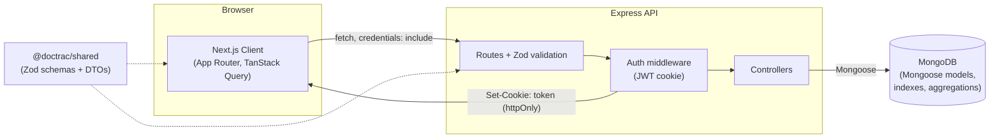

The client and server are deployed as two independent services with no shared process, filesystem, or in-memory state. Every interaction crosses the network as a REST call:

1. **Client → Server.** The browser calls the Express API directly, always with `credentials: "include"` so the auth cookie travels with the request. There is no server-side proxy or Next.js API route in between, the client is a pure consumer of the REST API.
2. **Auth.** `POST /api/auth/login` verifies credentials, signs a JWT, and returns it as an httpOnly cookie. Every subsequent request to a protected route runs through Express auth middleware that verifies that cookie before the request reaches a controller. See [Technical Decision 2](#2-cookie-based-jwt-auth-and-the-cross-domain-bug-it-caused-in-production) for how this plays out across two separate domains in production.
3. **Validation.** Route handlers parse `req.body`/`req.query` through Zod schemas from `@doctrac/shared` before any controller logic runs, requests that don't match the shape are rejected with a 400 before touching the database.
4. **Data access.** Controllers talk to MongoDB exclusively through Mongoose models (`User`, `Doctor`, `Patient`), each with indexes matched to how it's actually queried (see the pagination and search notes below).
5. **Dashboard.** A dedicated `GET /api/dashboard/stats` endpoint runs aggregation pipelines (`$lookup`, `$group`, `$size`) directly in MongoDB rather than pulling raw documents into Node and computing totals in application code.
6. **Shared contracts.** Both apps import the same Zod schemas and TypeScript DTOs from the `@doctrac/shared` workspace package, there is exactly one definition of what a "doctor" or "patient" object looks like in this system, not one per app.

## Technical Decisions

### 1. A shared Zod schema package instead of duplicated validation

**The problem.** The client and server are two independent codebases that both need to agree on the exact same data shapes: what fields a doctor has, what a valid phone number looks like, which gender values are allowed, what a paginated list response looks like. The obvious approach, writing a Zod schema in the server for request validation and a near-identical one in the client for `react-hook-form`, creates two sources of truth for the same rule. They will drift the first time someone edits one and forgets the other, and the failure mode is silent: the form happily lets a user submit something the API then rejects, or worse, the API accepts something the form was supposed to prevent.

**The decision.** The repo is an npm-workspaces monorepo with three packages: `client`, `server`, and `shared`. `shared` holds every Zod schema (`doctorInputSchema`, `patientInputSchema`, `loginSchema`, pagination/date-range query schemas, and so on) plus the TypeScript DTOs the frontend uses to type API responses. Both `client` and `server` depend on `@doctrac/shared` and import the literal same schema object, `zodResolver(doctorInputSchema)` on the frontend and `doctorInputSchema.parse(req.body)` on the backend are validating against one runtime definition, not two definitions that happen to look alike.

`shared` ships raw TypeScript source with no build step, consumed directly through its `package.json` `exports` map. This works because both consumers already transpile on the fly, Next.js's bundler transpiles workspace packages automatically, and the server runs on `tsx`, which does the same. A code-generation step or a published, versioned package would have solved the same problem with far more ceremony than a project this size needs.

**Real friction this caused, and how it was resolved:**

- Next.js only traces files inside `client/` into a production build by default, so `shared/`'s source would have silently been dropped. Fixed with `outputFileTracingRoot` in `client/next.config.ts`, pointed at the monorepo root.
- `radix-ui`'s TypeScript types failed to resolve because npm's workspace hoisting put `@types/react` inside `client/node_modules` while `radix-ui` itself was hoisted to the repo root, two packages needing the same types, looking in different places. Fixed by declaring `@types/react`/`@types/react-dom` in the root `package.json` too, so npm hoists one canonical copy both can see.
- On Render, the install has to run from the true repo root, not from inside `server/`, a workspace-scoped install run from a member directory recreates the exact duplicate-`node_modules` problem the monorepo exists to avoid.

**The payoff.** A phone-number regex, the list of valid genders, the fields a doctor requires, each rule is written once. There is no code path in this app where the form's validation and the API's validation can disagree, because they are not two rules, they are one rule imported twice.

### 2. Cookie-based JWT auth, and the cross-domain bug it caused in production

**The decision.** On login, the server signs a JWT and returns it as an `httpOnly` cookie rather than a bearer token the client stores itself. `httpOnly` means client-side JavaScript can never read the token, which meaningfully shrinks the blast radius of an XSS bug compared to a token sitting in `localStorage`. In production the cookie is also set `secure: true` and `sameSite: "none"`, the combination a browser actually requires for a cookie to survive a genuinely cross-origin request, since the client and server are deployed as two separate Render services with unrelated domains, not one origin with a same-site API route.

**What went wrong, and why it was so hard to spot locally.** The original route-protection design (built as its own milestone) used a Next.js `proxy.ts` (the App Router's edge middleware) that inspected `request.cookies` before any protected page rendered, and redirected to `/login` if the auth cookie was missing. Locally, this worked perfectly. The reason turned out to be an accident of the test environment rather than a property of the actual design: `localhost` cookies aren't port-scoped in the browser, so a cookie set by the server on `localhost:5000` was, in the cookie jar, indistinguishable from one belonging to `localhost:3000`. The client's edge middleware could "see" the server's cookie only because both were `localhost`.

Once deployed to Render, with the client and server on two genuinely unrelated domains (no shared parent domain, since both are free `.onrender.com` subdomains), that illusion broke. A cookie set by the server is visible only to requests made directly to the server's own domain. The Next.js proxy runs as part of the *client's* server process, on the client's domain, it could structurally never see a cookie scoped to the server's domain, no amount of `sameSite`/`secure` tuning changes that. Login itself always succeeded (`POST /api/auth/login` from the browser to the server is a direct, credentialed cross-origin request, which works fine with `sameSite: "none"`), but the very next navigation to a protected page ran the edge check against a cookie it could never see, and silently bounced back to `/login`. From the outside this looked exactly like "I click Log In, it loads, and nothing happens."

**The fix.** `proxy.ts` was removed entirely. Route protection now happens client-side, in an `AuthGuard` component that wraps the dashboard layout and verifies the session with a real authenticated request, `GET /api/auth/me`, the same mechanism every other API call in the app already uses. That request is a direct, credentialed call from the browser to the server's own origin, so it correctly carries the cookie regardless of what domain the client happens to be served from.

```tsx
export function AuthGuard({ children }: { children: ReactNode }) {
  const router = useRouter();
  const pathname = usePathname();
  const { data, isPending, isError } = useMeQuery();

  useEffect(() => {
    if (!isPending && isError) {
      router.replace(`/login?from=${encodeURIComponent(pathname)}`);
    }
  }, [isPending, isError, pathname, router]);

  if (isPending || isError || !data) {
    return <p>Loading...</p>;
  }
  return <>{children}</>;
}
```

An alternative fix would have been serving both apps under one parent domain (`app.example.com` / `api.example.com`) with the cookie scoped to `Domain=.example.com`, which would let edge middleware see it again. That requires a custom domain, which wasn't available on the free tier used for this deployment, so it wasn't the fix pursued here.

**The generalizable lesson.** A check that happens to pass in one environment because of an environment-specific quirk, port-agnostic `localhost` cookies, is not evidence the check is architecturally sound. The fix that actually generalizes across deployment topologies is verifying auth via a real round trip to the source of truth (the server), not by trying to inspect state that, by design, only the server and a same-origin cookie jar can see.

### Other decisions worth knowing about

**Mongoose over Drizzle.** Drizzle was considered first, but it is a SQL-only ORM (Postgres/MySQL/SQLite) with no MongoDB support, and the Drizzle maintainers have stated they don't plan to add one. Since the spec mandates MongoDB, this ruled Drizzle out immediately. Mongoose was chosen over the native MongoDB driver for its schema layer (validation, defaults, typed models) and built-in index declarations, which map directly onto the query-optimization requirements in the spec.

**`skip`/`limit` pagination over cursor (keyset) pagination.** Cursor pagination only pays for its added complexity at real depth, tens or hundreds of thousands of rows per collection, and this app's realistic scale is low hundreds to low thousands of doctors and patients. At that scale, an indexed `skip`/`limit` query is fast, and it enables something cursor pagination structurally can't: numbered pages ("Page 3 of 12"), which is what shadcn's `Pagination` component and the spec's own UX expectations assume. It also composes cleanly with relevance-ranked search results, where a keyset cursor has no natural ordering to key off of. The tradeoff is accepted deliberately: every list endpoint is backed by an index on its sort field and its filter fields, uses `.select()` projections to avoid over-fetching document bodies it won't render, and reuses that same index for the `countDocuments` call that produces the total page count.

**Case-insensitive search without a second index.** Doctor and patient names, and doctor specializations, are lowercased in the Mongoose schema itself (a `set` transform) before they're ever written to MongoDB, and the same lowercasing is applied to the incoming search term before the query runs. The data in the database is always lowercase; what the user sees is re-capitalized for display only, so there is no illusion of a capitalized value stored anywhere. This avoids needing a case-insensitive collation or a second normalized field just to make `"john"` match `"John"`. Specialization search specifically uses an escaped, unanchored substring regex (`{ $regex, $options: "i" }`) rather than MongoDB's `$text` index, since a single document can only be matched by one `$text` clause at a time, which would have made it impossible to search doctors by name and specialization independently in the same request.

**Bun to Node/npm.** The project started on Bun, but Mongoose doesn't reliably run under Bun's runtime (`bun run <script>` executes inside Bun regardless of what the script itself does), which surfaced as intermittent, hard-to-diagnose database errors. Both apps were migrated to Node with npm scripts early, before either had much surface area, specifically to keep Mongoose on a runtime it's actually tested against.

**Render over Vercel for the server.** Vercel's serverless model doesn't fit a standalone Express server that needs a persistent, long-lived process (an open MongoDB connection pool, in particular). Render's Web Service model runs the server as a normal persistent process, which is what Express expects. The client is also deployed to Render (rather than splitting them across Vercel and Render) so both halves share one deployment model and one place to look at logs.

**A production dependency-pruning bug worth recording.** The first Render deploy of the server failed with `tsx not found`, despite working locally. The cause: `npm install` with `NODE_ENV=production` prunes `devDependencies`, and `tsx` was listed there even though it's the actual runtime the production `start` script (`tsx src/server.ts`) depends on, not just a local dev convenience. Fixed by moving `tsx` into `dependencies`, where a production runtime dependency belongs, rather than reaching for a build-command flag that would have masked the real classification error.

## Project Structure

```
doctrac/
├── client/                  # Next.js 16 app (App Router, TypeScript)
│   └── src/
│       ├── app/              # (auth) and (dashboard) route groups
│       ├── components/       # feature components + shadcn/ui primitives
│       ├── lib/               # api client, TanStack Query hooks, utils
│       └── components/auth-guard.tsx
├── server/                  # Express 5 app (TypeScript, tsx runtime)
│   └── src/
│       ├── config/            # db connection, env validation
│       ├── models/            # User, Doctor, Patient (Mongoose)
│       ├── controllers/
│       ├── routes/
│       ├── middleware/        # auth, error handling, validation
│       └── scripts/           # seedAdmin, seedData
├── shared/                  # @doctrac/shared: Zod schemas + DTOs
│   ├── schemas/
│   ├── types.ts
│   └── constants.ts
└── docs/
    └── requirement.md
```

## Visual Evidence

### Login

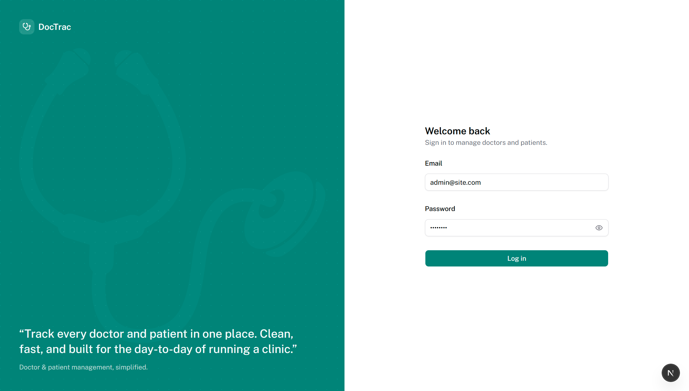
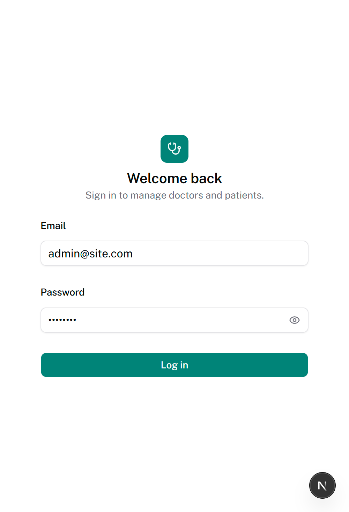

### Dashboard

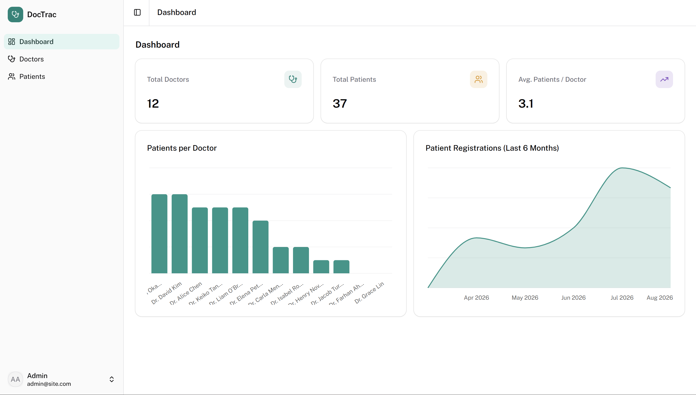
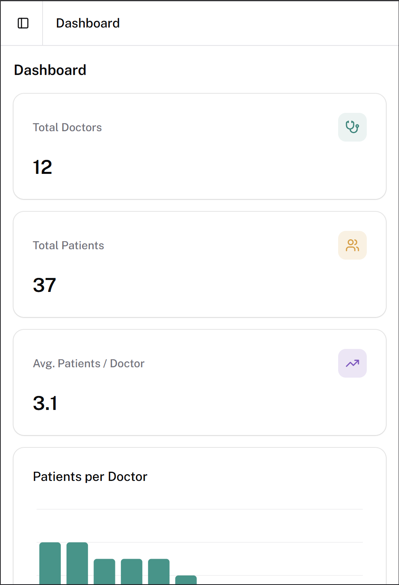

### Doctors

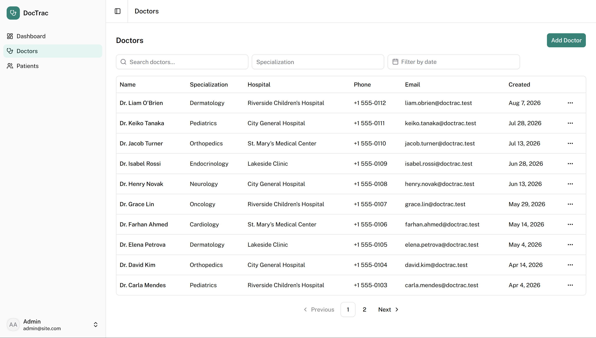
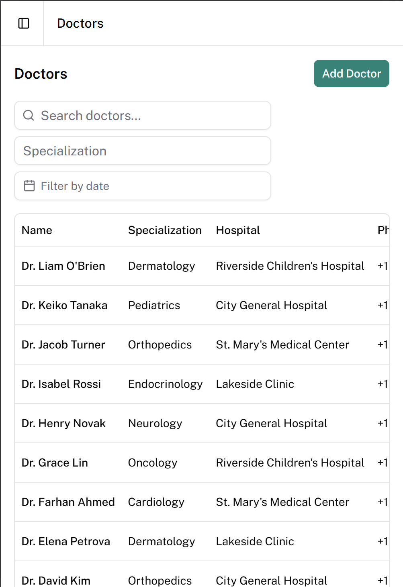
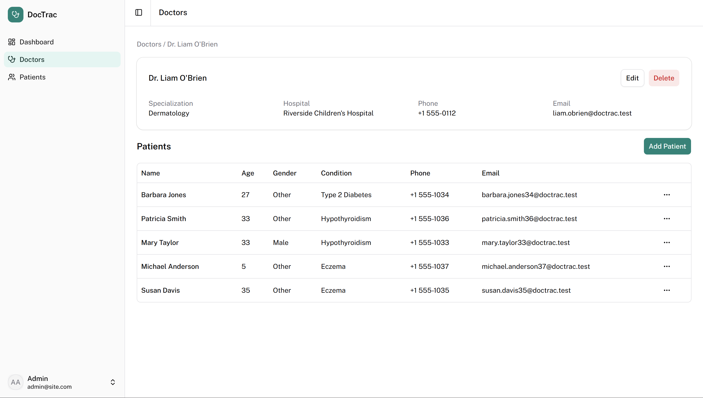
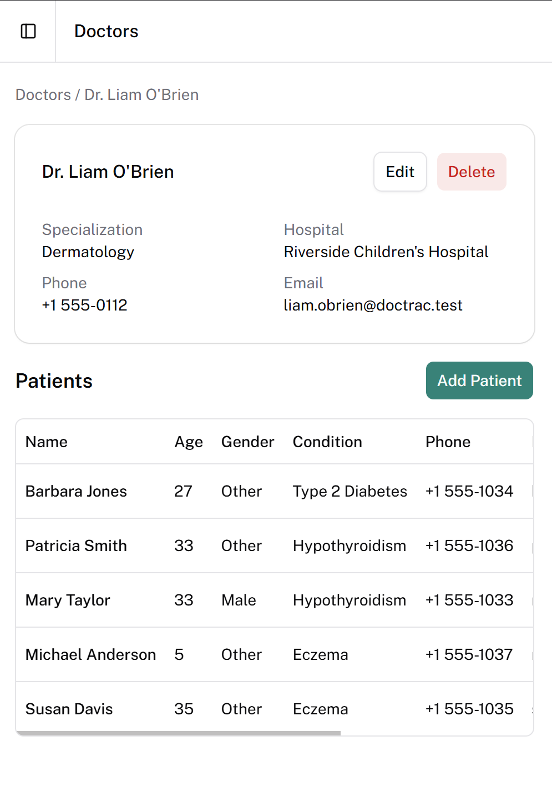
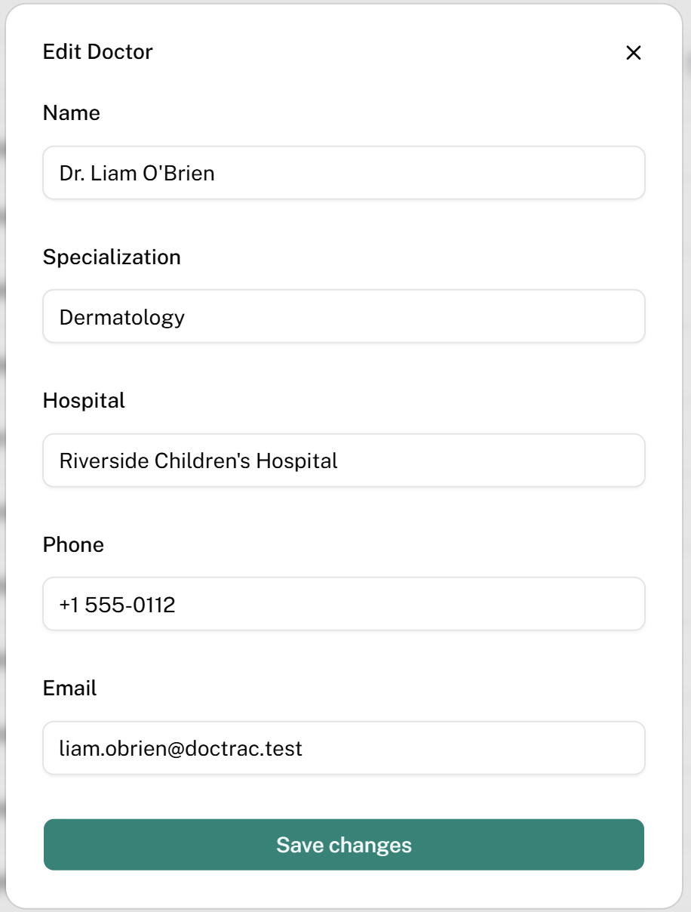

### Patients

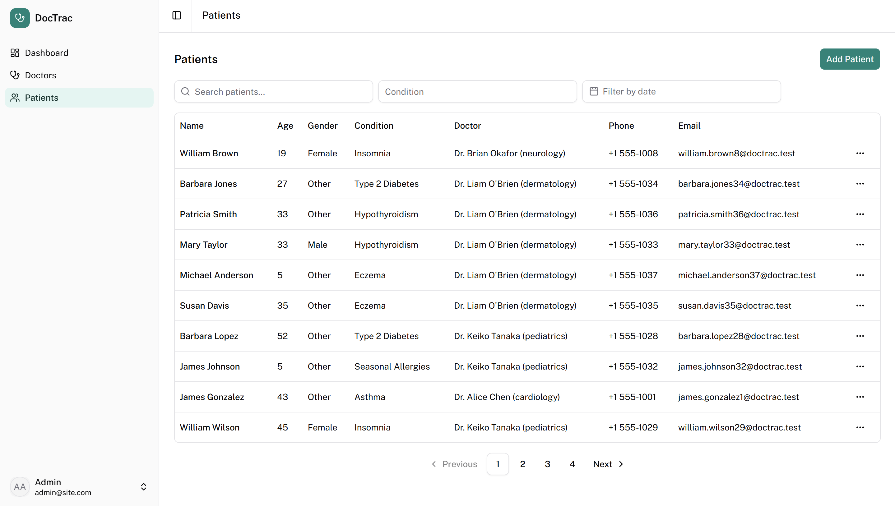
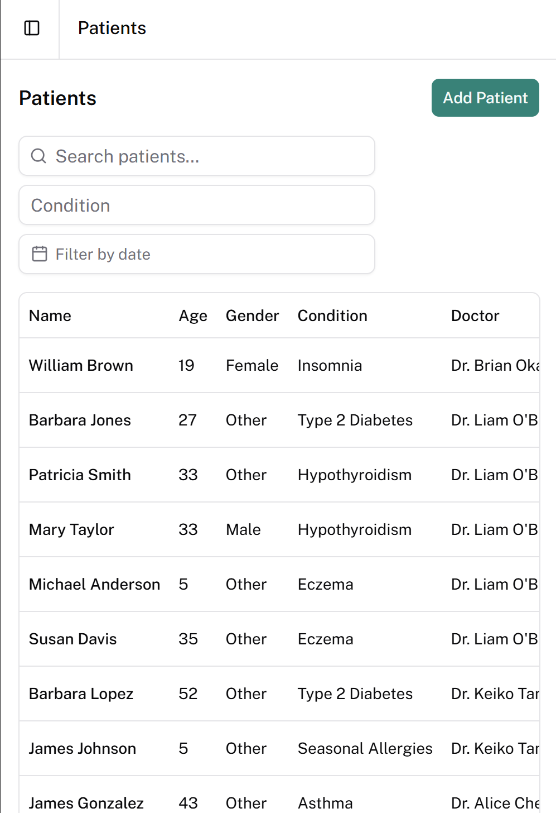
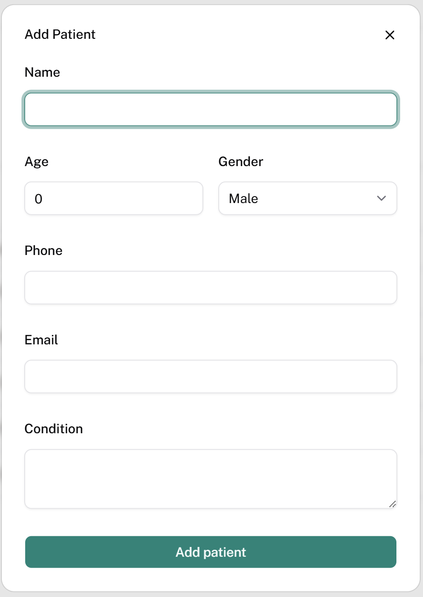

### Mobile navigation

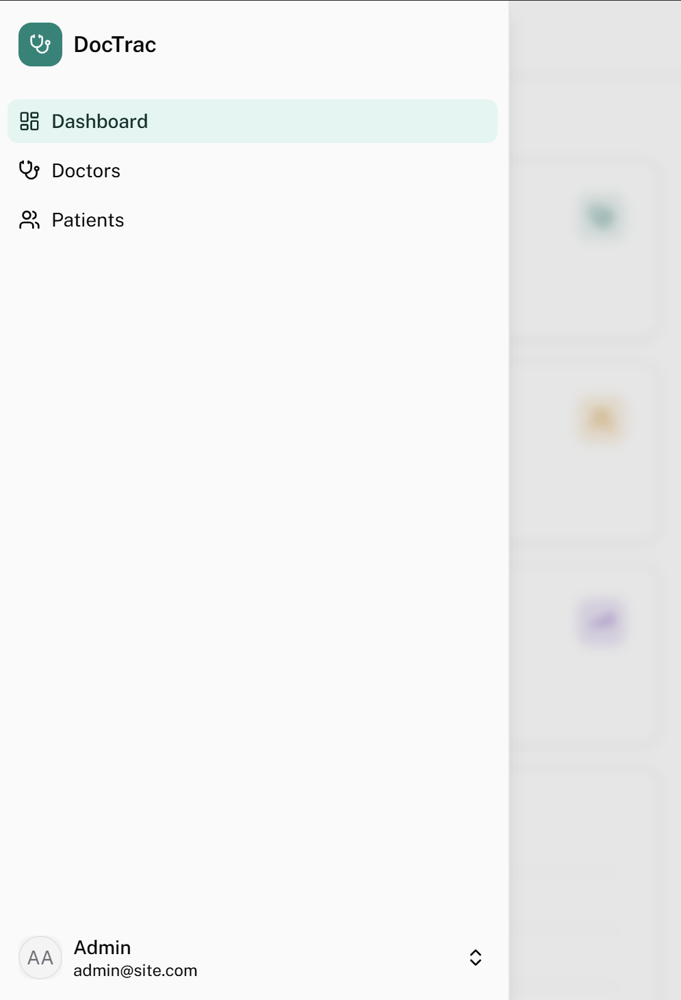
